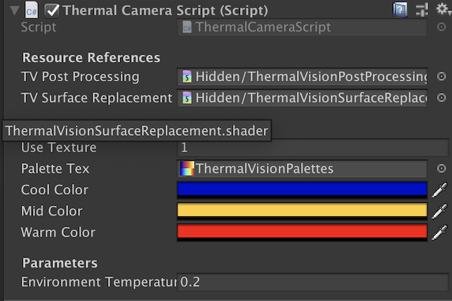

# Unity thermal camera for built in RP

Took the idea from [here](https://github.com/m3rt32/ThermalVisionPostProcessingShader) and made some modifications.

## Usage

Clone this repo into `Assets`

Add `ThermalCameraScript` to your camera and hook up the resource references (mouse hover each property to see details)

For any heat emissive object, add `TemperatureController` to it and set its temperature (manually or with script) (Again mouse over the property for details).

When the game is running, press space to toggle between normal view and thermal vision. Or edit `Update()` in ThermalCameraScript.cs to set up your own toggle.
